# javi-forge

> Project scaffolding — AI-ready CI bootstrap with templates for Go, Java, Node, Python, Rust

[](https://www.npmjs.com/package/javi-forge)
[](LICENSE)

## Quick Start

```bash
npx javi-forge init
```

An interactive TUI guides you through project setup: pick a stack, CI provider, memory module, and get a production-ready project structure in seconds.

## What It Creates

`javi-forge init` bootstraps a complete project with 13 sequential steps:

```mermaid
flowchart LR
    A["javi-forge init"] --> B["git init"]
    B --> C["CI workflow"]
    C --> D[".gitignore"]
    D --> E["dependabot.yml"]
    E --> F["Memory module"]
    F --> G["javi-ai sync"]
    G --> H["openspec/ (SDD)"]
    H --> I["GHAGGA review"]
    I --> J["Mock mode"]
    J --> K[".context/"]
    K --> L["CLAUDE.md"]
    L --> M["Manifest"]
```



### Step-by-Step

| Step | What it does |
|------|-------------|
| 1 | Initialize git repository |
| 2 | Configure git hooks path (`ci-local/hooks`) |
| 3 | Copy CI workflow for your stack and provider |
| 4 | Generate `.gitignore` from template |
| 5 | Generate `dependabot.yml` (GitHub only) |
| 6 | Install memory module (engram, obsidian-brain, or memory-simple) |
| 7 | Sync AI config via `javi-ai sync --target all` |
| 8 | Set up SDD with `openspec/` directory |
| 9 | Install GHAGGA review system (optional) |
| 10 | Configure mock-first mode (optional) |
| 11 | Generate `.context/` directory with `INDEX.md` and `summary.md` |
| 12 | Generate project-aware `CLAUDE.md` (stack, conventions, skills) |
| 13 | Write forge manifest to `.javi-forge/manifest.json` |

## Templates

| Stack | CI Templates | Dependabot |
|-------|-------------|------------|
| **node** | GitHub Actions, GitLab CI, Woodpecker | npm |
| **python** | GitHub Actions, GitLab CI, Woodpecker | pip |
| **go** | GitHub Actions, GitLab CI, Woodpecker | gomod |
| **java-gradle** | GitHub Actions, GitLab CI, Woodpecker | gradle |
| **java-maven** | GitHub Actions, GitLab CI, Woodpecker | maven |
| **rust** | GitHub Actions, GitLab CI, Woodpecker | cargo |
| **elixir** | GitHub Actions, GitLab CI, Woodpecker | — |

## CI Providers

| Provider | Workflow location | Dependabot |
|----------|------------------|------------|
| **GitHub Actions** | `.github/workflows/ci.yml` | `.github/dependabot.yml` |
| **GitLab CI** | `.gitlab-ci.yml` | — |
| **Woodpecker** | `.woodpecker.yml` | — |

## Memory Modules

| Module | Description |
|--------|-------------|
| **engram** | Persistent AI memory via MCP server. Best for cross-session context |
| **obsidian-brain** | Obsidian-based project memory with Kanban, Dataview, and session tracking |
| **memory-simple** | Minimal file-based project memory |
| **none** | Skip memory module |

## Commands

| Command | Description |
|---------|-------------|
| `init` | Bootstrap a new project (default) |
| `ci` | Run CI simulation (lint + compile + test + security + ghagga) |
| `ci init` | Install git hooks in `.git/hooks/` (recommended for existing repos) |
| `tdd init` | Install TDD-enforcing pre-commit hook (auto-detects stack) |
| `analyze` | Run repoforge skills analysis on current project |
| `doctor` | Show comprehensive health report |
| `plugin add` | Install a plugin from GitHub (`org/repo`) |
| `plugin remove` | Remove an installed plugin |
| `plugin list` | List installed plugins |
| `plugin search` | Search the plugin registry |
| `plugin validate` | Validate a local plugin directory |
| `plugin sync` | Auto-detect and wire installed plugins into manifest |
| `plugin export` | Export plugin to Agent Skills spec (`skills.json`) |
| `plugin export --codex` | Export plugin to Codex-compatible TOML subagent files |
| `plugin import` | Import an Agent Skills spec package as a javi-forge plugin |
| `skills doctor` | Show skills health report (conflict + duplicate detection) |
| `skills budget` | Show token cost of loaded skills |
| `skills score` | Score a skill on quality dimensions (0-100) |
| `skills benchmark` | Benchmark a skill with structural quality checks |
| `security baseline` | Create security baseline from current audit findings |
| `security check` | Check for regressions against baseline (exits non-zero if found) |
| `security update` | Re-snapshot baseline (acknowledge current vulns) |
| `llms-txt` | Generate AI-friendly `llms.txt` for current project |

```bash
npx javi-forge init
npx javi-forge init --stack node --ci github
npx javi-forge ci
npx javi-forge ci init
npx javi-forge tdd init
npx javi-forge analyze
npx javi-forge doctor
npx javi-forge plugin sync
npx javi-forge plugin export my-plugin --codex
npx javi-forge skills doctor --deep
npx javi-forge skills budget -b 10000
npx javi-forge skills score react-19
npx javi-forge security baseline
npx javi-forge security check
npx javi-forge llms-txt
```

### CLI Flags

| Flag | Type | Default | Description |
|------|------|---------|-------------|
| `--dry-run` | boolean | `false` | Preview without writing files |
| `--stack` | string | — | Project stack |
| `--ci` | string | — | CI provider |
| `--memory` | string | — | Memory module |
| `--project-name` | string | — | Project name (skips name prompt) |
| `--no-docker` | boolean | `false` | Disable Docker in CI hooks |
| `--no-ci-ghagga` | boolean | `false` | Disable GHAGGA in CI hooks |
| `--no-security` | boolean | `false` | Skip Semgrep security scan in CI |
| `--ghagga` | boolean | `false` | Enable GHAGGA review system |
| `--mock` | boolean | `false` | Enable mock-first mode (no real API keys) |
| `--batch` | boolean | `false` | Non-interactive mode |
| `--quick` | boolean | `false` | Lint + compile only (CI mode) |
| `--shell` | boolean | `false` | Open interactive shell in CI container |
| `--detect` | boolean | `false` | Show detected stack and exit (CI mode) |
| `--timeout` | number | `600` | Per-step timeout in seconds (CI mode) |
| `--deep` | boolean | `false` | Enable deep analysis (skills conflict detection) |
| `--budget, -b` | number | `8000` | Token budget limit for skills |
| `--skills-dir` | string | — | Custom skills directory path |
| `--codex` | boolean | `false` | Export plugin as Codex TOML (plugin export) |

## AI Config

`javi-forge` ships with a comprehensive `.ai-config/` library:

| Category | Count | Description |
|----------|-------|-------------|
| **Agents** | 8 groups | Domain-specific agent definitions |
| **Skills** | 84 skills | Organized by domain (backend, frontend, infra, etc.) |
| **Commands** | 20 | Slash-command definitions for Claude |
| **Hooks** | 11 | Pre/post tool-use automation hooks |

The AI config is synced into your project via `javi-ai sync` during init.

## Context Directory Generation

During `init`, javi-forge generates a `.context/` directory with two files:

| File | Purpose |
|------|---------|
| `.context/INDEX.md` | File index with directory structure, entry point, and conventions |
| `.context/summary.md` | Project summary for AI agents |

The content is stack-aware: it uses the detected stack (node, python, go, etc.) to generate relevant directory trees, entry points, and convention hints. AI tools can read `.context/` for instant project understanding.

## CLAUDE.md Generation

`init` generates a project-level `CLAUDE.md` tailored to your stack. It includes:

- Stack and runtime information
- Coding conventions and test framework
- Relevant skills to load (e.g., `react-19`, `typescript`, `tailwind-4`)
- Installed modules (memory, SDD, GHAGGA)
- Reference to `.context/` directory if enabled

This gives Claude Code immediate project awareness without manual configuration.

## Plugin System

Manage javi-forge plugins (skills, hooks, agents):

```bash
npx javi-forge plugin add mapbox/agent-skills   # install from GitHub
npx javi-forge plugin remove agent-skills        # remove by name
npx javi-forge plugin list                       # list installed
npx javi-forge plugin search "react"             # search registry
npx javi-forge plugin validate ./my-plugin       # validate local plugin
npx javi-forge plugin sync                       # auto-detect and wire plugins
```

### Plugin Sync

`plugin sync` scans the project for installed plugins and updates the forge manifest. It detects additions, removals, and unchanged plugins:

```bash
npx javi-forge plugin sync
# added: my-plugin | unchanged: core-skills
```

### Agent Skills Interop

Export javi-forge plugins to the Agent Skills spec or Codex TOML format for cross-tool compatibility:

```bash
npx javi-forge plugin export my-plugin           # exports skills.json (Agent Skills spec)
npx javi-forge plugin export my-plugin --codex   # exports .toml subagent files (Codex)
npx javi-forge plugin import ./agent-skills-pkg  # import Agent Skills package as plugin
```

## Security Baseline

Track and detect security regressions with baseline snapshots:

```bash
npx javi-forge security baseline   # create baseline from current audit
npx javi-forge security check      # check for regressions (non-zero exit if found)
npx javi-forge security update     # re-snapshot baseline (acknowledge current vulns)
```

Supports **node** (npm/pnpm/yarn audit), **python** (pip-audit), **go** (govulncheck), and **rust** (cargo audit). The baseline is stored in `.javi-forge/security-baseline.json`.

`security check` compares current findings against the baseline and reports regressions (new vulnerabilities) and resolutions. It exits non-zero when regressions are found, making it suitable for CI pipelines.

## TDD Hook

Install a test-driven development pre-commit hook that enforces tests must pass before any commit:

```bash
npx javi-forge tdd init
```

Auto-detects your stack and wires the correct test command (`npm test`, `pytest`, `go test ./...`). To bypass: `git commit --no-verify`.

## Skills Management

### Skills Doctor

Analyze installed skills for health, conflicts, and duplicates:

```bash
npx javi-forge skills doctor          # basic health + token budget
npx javi-forge skills doctor --deep   # + conflict detection + duplicate detection
```

With `--deep`, the doctor scans all SKILL.md critical rules for contradictions (e.g., "use semicolons" vs "no semicolons") and detects overlapping trigger keywords between skills.

### Skills Budget

Show token cost of all loaded skills and check against a budget:

```bash
npx javi-forge skills budget           # default budget: 8000 tokens
npx javi-forge skills budget -b 12000  # custom budget
```

Lists skills sorted by token consumption and suggests which to disable if over budget.

### Skills Score

Score a skill on four quality dimensions (0-100 each):

```bash
npx javi-forge skills score react-19
```

| Dimension | Weight | What it measures |
|-----------|--------|-----------------|
| Completeness | 30% | Frontmatter, critical rules, content depth |
| Clarity | 25% | Actionable rules, no vague terms, structured sections |
| Testability | 25% | Given/When/Then scenarios, code examples, specificity |
| Token Efficiency | 20% | Rules-per-1000-tokens ratio, total size |

Exits non-zero if overall score is below threshold (default: 50).

### Skills Benchmark

Run structural quality checks against a skill:

```bash
npx javi-forge skills benchmark react-19
```

Checks: frontmatter name, triggers, critical rules (>= 3), actionable verbs, code examples, section headings, token budget (<= 3000), no vague terms. Reports pass rate as a percentage.

## LLMs.txt

Generate an AI-friendly `llms.txt` file with compact project notation (~75% fewer tokens than full docs):

```bash
npx javi-forge llms-txt
npx javi-forge llms-txt --dry-run
```

## RepoForge Integration

The `analyze` command wraps [repoforge](https://github.com/Gentleman-Programming/repoforge) to run skills analysis on your project:

```bash
npx javi-forge analyze
```

This requires `repoforge` to be installed (`pip install repoforge`). It analyzes your codebase and generates skill recommendations.

## Doctor

The `doctor` command runs comprehensive health checks:

```bash
npx javi-forge doctor
```

### What it checks

- **System Tools** — git, docker, semgrep, node, pnpm
- **Framework Structure** — templates/, modules/, ai-config/, workflows/, schemas/, ci-local/
- **Stack Detection** — Detects project type from files (package.json, go.mod, Cargo.toml, etc.)
- **Project Manifest** — Reads `.javi-forge/manifest.json`
- **Installed Modules** — engram, obsidian-brain, memory-simple, ghagga

## Requirements

- **Node.js** >= 18

## Ecosystem

| Package | Description |
|---------|-------------|
| [javi-dots](https://github.com/JNZader/javi-dots) | Workstation setup (top-level orchestrator) |
| [javi-ai](https://github.com/JNZader/javi-ai) | AI development layer (called by forge during sync) |
| **javi-forge** | Project scaffolding (this package) |

## License

[MIT](LICENSE)
