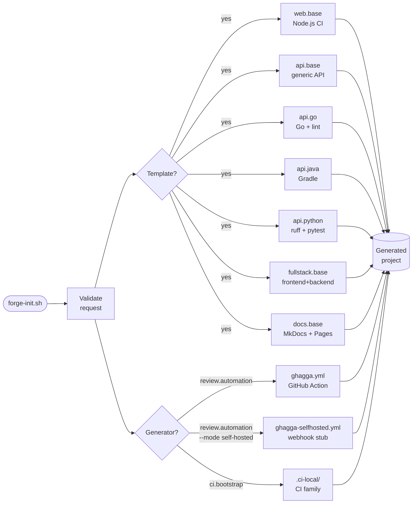

# javi-forge

> **Project scaffolding for the Javi ecosystem.** Generate production-ready CI pipelines, GitHub Actions workflows, and AI code review automation for any stack — in seconds.

---

## How it works



---

## Quick Start

### Via javi-dots (recommended)

```bash
# Generate a web project
scripts/javi.sh --preset forge \
  --template-choice forge.template.web.base \
  --project-name my-app \
  --home "$HOME"

# Generate a Go API + review automation
scripts/javi.sh --preset forge \
  --template-choice forge.template.api.go \
  --generator-choice forge.generator.review.automation \
  --project-name my-api \
  --home "$HOME"
```

### Direct usage

```bash
# Dry-run a Go API template
scripts/forge-init.sh \
  --template template.api.go \
  --project-name my-api \
  --destination ~/projects \
  --dry-run

# Generate Python API + review automation
scripts/forge-init.sh \
  --template template.api.python \
  --generator generator.review.automation \
  --project-name my-api \
  --destination ~/projects

# Add CI bootstrap to an existing project
scripts/forge-init.sh \
  --generator generator.ci.bootstrap \
  --project-name existing-project \
  --destination ~/existing-project

# List all available templates and generators
scripts/forge-init.sh --list-contracts
```

---

## Templates

| Template ID | Stack | CI Workflow | Includes |
|-------------|-------|-------------|---------|
| `template.web.base` | Node.js | Node CI (test + build) | ci-local, dependabot |
| `template.api.base` | Any (generic) | Language-agnostic CI | ci-local, dependabot |
| `template.api.go` | Go | golangci-lint + go test | ci-local, dependabot |
| `template.api.java` | Java / Spring Boot | Spotless + Gradle test | ci-local, dependabot |
| `template.api.python` | Python / FastAPI | ruff + pytest | ci-local, dependabot |
| `template.fullstack.base` | Any frontend + backend | Parallel jobs | ci-local, dependabot |
| `template.docs.base` | MkDocs | Build strict + gh-deploy | dependabot, mkdocs.yml.example |

---

## Generators

| Generator ID | Mode | Output | Composable |
|-------------|------|--------|------------|
| `generator.project.init` | default | Full project scaffold | with any template |
| `generator.ci.bootstrap` | standalone | `.ci-local/` family | yes, or standalone |
| `generator.review.automation` | `github-action` | `ghagga.yml` GitHub Action | yes |
| `generator.review.automation` | `self-hosted` | Webhook-trigger stub | yes |

### Review automation modes

```bash
# Default: free GitHub Action (GitHub Models, no key needed)
scripts/forge-init.sh --generator generator.review.automation \
  --project-name my-project --destination ~/projects

# Self-hosted: your own ghagga server
scripts/forge-init.sh --generator generator.review.automation \
  --review-mode self-hosted \
  --project-name my-project --destination ~/projects
```

---

## Generated output per template

Every template generates:

```
.github/
  workflows/
    ci.yml                  # Stack-specific CI workflow
    dependabot-automerge.yml
  dependabot.yml
.ci-local/                  # Local CI simulation (most templates)
  ci-local.sh
  install.sh
  semgrep.yml
  hooks/
    pre-commit
    commit-msg
    pre-push
lib/
  common.sh
.gitignore
```

The `docs.base` template additionally generates:

```
docs/
  index.md                  # Starter documentation page
mkdocs.yml.example          # Rename to mkdocs.yml
```

---

## AI Integration

Generated projects can optionally request AI packages from [javi-ai](https://github.com/JNZader/javi-ai):

| Template | Optional AI packages |
|---------|---------------------|
| `template.web.base` | `project.ai.instructions` · `project.sdd.base` · `project.memory.engram` · `project.ai.review` |
| `template.api.*` | same as above |
| `template.fullstack.base` | same as above |
| `template.docs.base` | `project.ai.instructions` · `project.memory.engram` |

---

## Documentation

See [`docs/quickstart.md`](docs/quickstart.md) for a comprehensive usage guide.

---

## Ecosystem

| Repo | Role |
|------|------|
| [javi-dots](https://github.com/JNZader/javi-dots) | Workstation setup, consumes javi-forge via contracts |
| [javi-ai](https://github.com/JNZader/javi-ai) | AI provider profiles and project packages |
| **javi-forge** | Project templates and generators |
| [javi-platform](https://github.com/JNZader/javi-platform) | Governance, ADRs, SDD artifacts |
