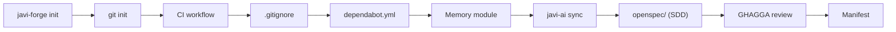

# javi-forge

> Project scaffolding — AI-ready CI bootstrap with templates for Go, Java, Node, Python, Rust

[](https://www.npmjs.com/package/javi-forge)
[](LICENSE)

## Quick Start

```bash
npx javi-forge init
```

An interactive TUI guides you through project setup: pick a stack, CI provider, memory module, and get a production-ready project structure in seconds.

## What It Creates

`javi-forge init` bootstraps a complete project with 10 sequential steps:



### Step-by-Step

| Step | What it does |
|------|-------------|
| 1 | Initialize git repository |
| 2 | Configure git hooks path (`ci-local/hooks`) |
| 3 | Copy CI workflow for your stack and provider |
| 4 | Generate `.gitignore` from template |
| 5 | Generate `dependabot.yml` (GitHub only) |
| 6 | Install memory module (engram, obsidian-brain, or memory-simple) |
| 7 | Sync AI config via `javi-ai sync --target all` |
| 8 | Set up SDD with `openspec/` directory |
| 9 | Install GHAGGA review system (optional) |
| 10 | Write forge manifest to `.javi-forge/manifest.json` |

## Templates

| Stack | CI Templates | Dependabot |
|-------|-------------|------------|
| **node** | GitHub Actions, GitLab CI, Woodpecker | npm |
| **python** | GitHub Actions, GitLab CI, Woodpecker | pip |
| **go** | GitHub Actions, GitLab CI, Woodpecker | gomod |
| **java-gradle** | GitHub Actions, GitLab CI, Woodpecker | gradle |
| **java-maven** | GitHub Actions, GitLab CI, Woodpecker | maven |
| **rust** | GitHub Actions, GitLab CI, Woodpecker | cargo |
| **elixir** | GitHub Actions, GitLab CI, Woodpecker | — |

## CI Providers

| Provider | Workflow location | Dependabot |
|----------|------------------|------------|
| **GitHub Actions** | `.github/workflows/ci.yml` | `.github/dependabot.yml` |
| **GitLab CI** | `.gitlab-ci.yml` | — |
| **Woodpecker** | `.woodpecker.yml` | — |

## Memory Modules

| Module | Description |
|--------|-------------|
| **engram** | Persistent AI memory via MCP server. Best for cross-session context |
| **obsidian-brain** | Obsidian-based project memory with Kanban, Dataview, and session tracking |
| **memory-simple** | Minimal file-based project memory |
| **none** | Skip memory module |

## Commands

| Command | Description |
|---------|-------------|
| `init` | Bootstrap a new project (default) |
| `analyze` | Run repoforge skills analysis on current project |
| `doctor` | Show comprehensive health report |

```bash
npx javi-forge init
npx javi-forge init --stack node --ci github
npx javi-forge analyze
npx javi-forge doctor
```

### CLI Flags

| Flag | Type | Default | Description |
|------|------|---------|-------------|
| `--dry-run` | boolean | `false` | Preview without writing files |
| `--stack` | string | — | Project stack |
| `--ci` | string | — | CI provider |
| `--memory` | string | — | Memory module |
| `--project-name` | string | — | Project name (skips name prompt) |
| `--ghagga` | boolean | `false` | Enable GHAGGA review system |
| `--batch` | boolean | `false` | Non-interactive mode |

## AI Config

`javi-forge` ships with a comprehensive `.ai-config/` library:

| Category | Count | Description |
|----------|-------|-------------|
| **Agents** | 8 groups | Domain-specific agent definitions |
| **Skills** | 84 skills | Organized by domain (backend, frontend, infra, etc.) |
| **Commands** | 20 | Slash-command definitions for Claude |
| **Hooks** | 11 | Pre/post tool-use automation hooks |

The AI config is synced into your project via `javi-ai sync` during init.

## RepoForge Integration

The `analyze` command wraps [repoforge](https://github.com/Gentleman-Programming/repoforge) to run skills analysis on your project:

```bash
npx javi-forge analyze
```

This requires `repoforge` to be installed (`pip install repoforge`). It analyzes your codebase and generates skill recommendations.

## Doctor

The `doctor` command runs comprehensive health checks:

```bash
npx javi-forge doctor
```

### What it checks

- **System Tools** — git, docker, semgrep, node, pnpm
- **Framework Structure** — templates/, modules/, ai-config/, workflows/, schemas/, ci-local/
- **Stack Detection** — Detects project type from files (package.json, go.mod, Cargo.toml, etc.)
- **Project Manifest** — Reads `.javi-forge/manifest.json`
- **Installed Modules** — engram, obsidian-brain, memory-simple, ghagga

## Requirements

- **Node.js** >= 18

## Ecosystem

| Package | Description |
|---------|-------------|
| [javi-dots](https://github.com/JNZader/javi-dots) | Workstation setup (top-level orchestrator) |
| [javi-ai](https://github.com/JNZader/javi-ai) | AI development layer (called by forge during sync) |
| **javi-forge** | Project scaffolding (this package) |

## License

[MIT](LICENSE)
