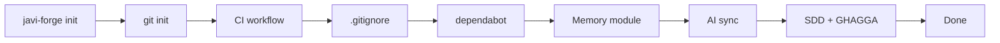

# javi-forge

> Project scaffolding — AI-ready CI bootstrap with templates for Go, Java, Node, Python, Rust

[](https://www.npmjs.com/package/javi-forge)
[](LICENSE)

## Quick Start

```bash
npx javi-forge init
```

An interactive TUI guides you through project setup: stack, CI provider, memory module, and more.



## What You Get

After running `javi-forge init`, your project has:

- Git repository with configured hooks
- CI/CD pipeline for your stack and provider
- `.gitignore` and `dependabot.yml`
- Memory module for AI persistence
- AI config synced for all coding assistants
- SDD (Spec-Driven Development) directory
- Optional GHAGGA code review

## Supported Stacks

| Stack | Language |
|-------|----------|
| `node` | JavaScript / TypeScript |
| `python` | Python |
| `go` | Go |
| `java-gradle` | Java (Gradle) |
| `java-maven` | Java (Maven) |
| `rust` | Rust |
| `elixir` | Elixir |

## Ecosystem

| Package | Role |
|---------|------|
| [javi-dots](https://github.com/JNZader/javi-dots) | Workstation setup |
| [javi-ai](https://github.com/JNZader/javi-ai) | AI development layer |
| **javi-forge** | Project scaffolding (this package) |

## License

[MIT](LICENSE)
