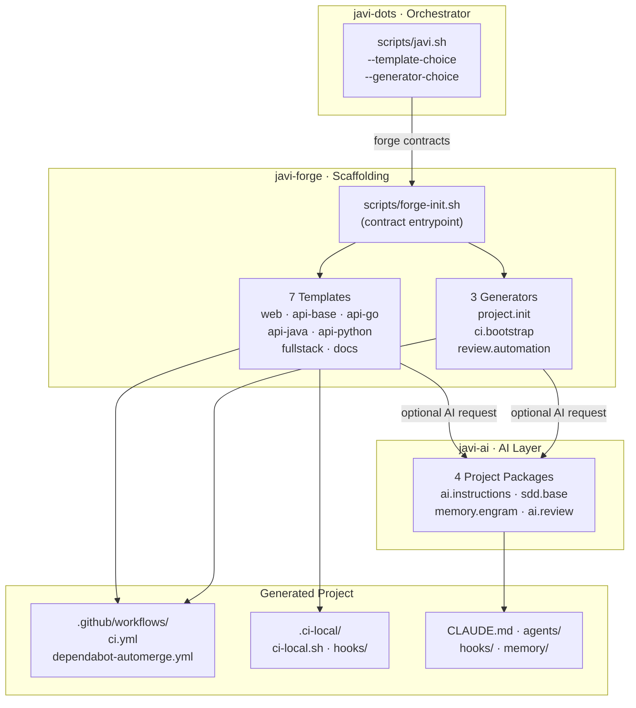
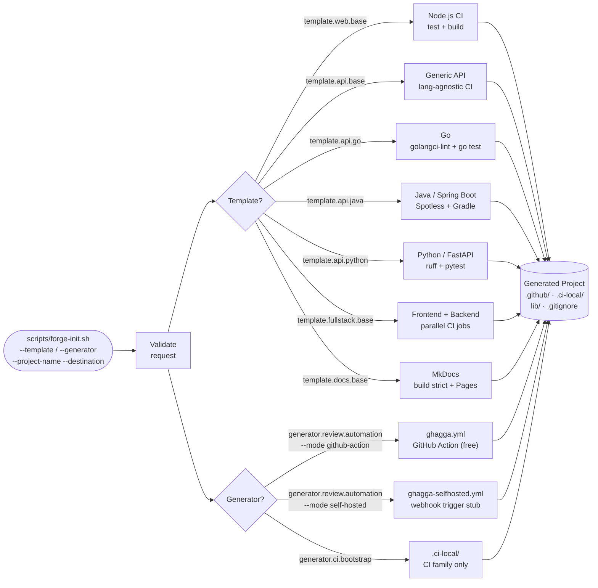

# javi-forge

> **Project scaffolding for the Javi ecosystem.** Generate production-ready CI pipelines, GitHub Actions workflows, and AI code review automation for any stack — in seconds.

---

## What is javi-forge?

`javi-forge` is the scaffolding engine of the Javi ecosystem. It provides:

- **7 stack-specific templates** — Node.js, Go, Java, Python, generic API, fullstack, and MkDocs docs
- **3 generators** — project init, CI bootstrap, and review automation
- **AI integration** — optional project-facing AI packages from `javi-ai` for any generated repo

Everything is delivered via `scripts/forge-init.sh`, a contract-based CLI entrypoint. Consumers reference templates and generators by stable published IDs — never by internal directory paths.

---

## Ecosystem Role

---

## Template and Generator Flow

---

## Quick Links

- [Getting Started](/getting-started) — standalone and via javi-dots
- [Templates](/templates) — all 7 templates with generated output examples
- [Generators](/generators) — project.init, ci.bootstrap, review.automation
- [AI Integration](/ai-integration) — optional AI packages for generated projects
