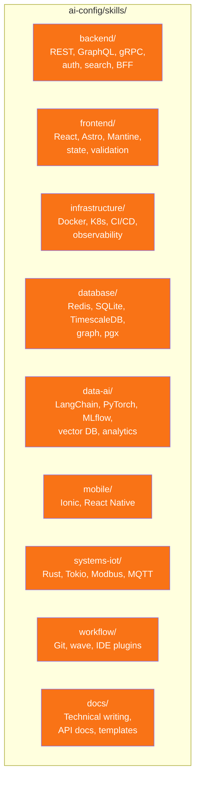
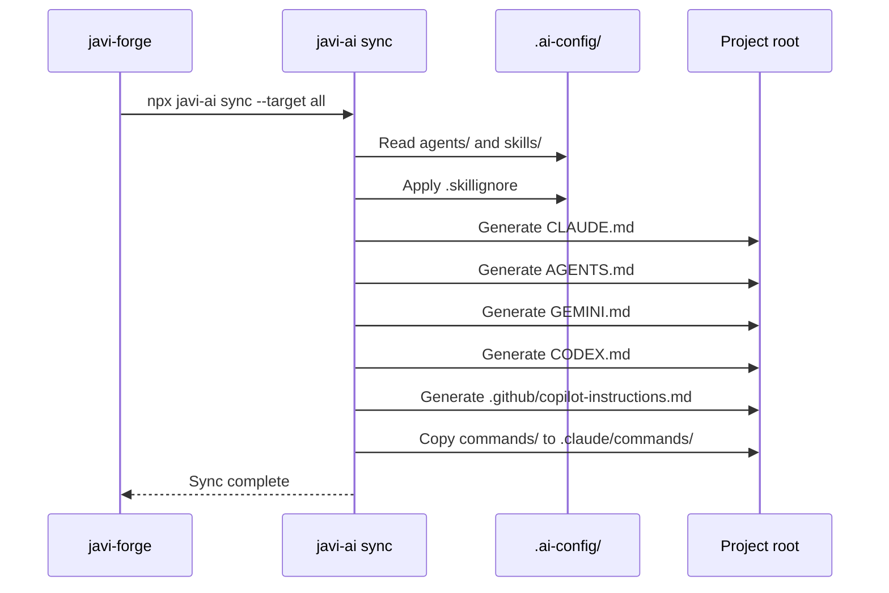

# AI Config

`javi-forge` ships with a comprehensive AI configuration library in `ai-config/`. This gets synced into your project during `init` via `javi-ai sync`.

## Inventory

| Category | Count | Location |
|----------|-------|----------|
| **Agents** | 8 groups | `ai-config/agents/` |
| **Skills** | 84 skills | `ai-config/skills/` |
| **Commands** | 20 commands | `ai-config/commands/` |
| **Hooks** | 11 hooks | `ai-config/hooks/` |
| **Prompts** | System prompts | `ai-config/prompts/` |

## Agents

Agent definitions organized by domain. Each agent has a name, description, and specialized instructions.

The 8 agent groups cover:

- Backend development
- Frontend development
- Infrastructure and DevOps
- Database and data
- Testing and quality
- Documentation
- Workflow automation
- Systems and IoT

## Skills

84 skills organized by domain, covering the full development lifecycle:



## Commands

20 slash-command definitions for Claude Code. These are copied to `project/.claude/commands/` during sync.

Commands include SDD workflow commands (`/sdd:new`, `/sdd:apply`, etc.) and utility commands.

## Hooks

11 pre/post tool-use hooks for automation:

- Auto-formatting after file edits
- Type checking on save
- Test runner triggers
- Protection hooks for sensitive files

## .skillignore

The `ai-config/.skillignore` file controls which skills are excluded from sync:

```
# Exclude a skill from all CLIs
skill-name

# Exclude only from a specific CLI
opencode:skill-name
```

## How Sync Works

During `javi-forge init`, the AI config is synced via `javi-ai`:



## AUTO_INVOKE.md

The `ai-config/AUTO_INVOKE.md` file contains instructions that are automatically included in generated config files, providing base-level instructions for all AI coding assistants.

## config.yaml

The `ai-config/config.yaml` controls sync behavior: which skills to include, agent ordering, and provider-specific overrides.
