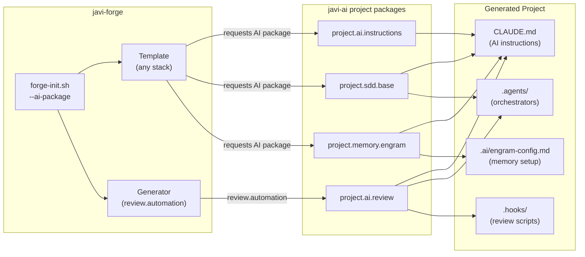
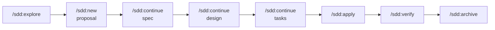

# AI Integration

`javi-forge` templates and generators can optionally request **project-facing AI packages** from `javi-ai`. These packages add AI coding capabilities to generated projects without coupling them to any specific AI provider.

---

## How it works



---

## Available AI packages

| Package ID | Composed from | Adds to project |
|-----------|---------------|----------------|
| `project.ai.instructions` | `shared.instructions` | `CLAUDE.md` (provider-neutral instructions) |
| `project.sdd.base` | `shared.instructions` + `shared.agents` | `CLAUDE.md` + `.agents/` orchestrators |
| `project.memory.engram` | `shared.memory` + `shared.instructions` | `CLAUDE.md` + Engram MCP config |
| `project.ai.review` | `shared.hooks` + `shared.agents` + `shared.instructions` | `CLAUDE.md` + `.agents/` + `.hooks/` |

---

## Which templates support AI packages

| Template | Supported AI packages |
|---------|----------------------|
| `template.web.base` | all 4 |
| `template.api.base` | all 4 |
| `template.api.go` | all 4 |
| `template.api.java` | all 4 |
| `template.api.python` | all 4 |
| `template.fullstack.base` | all 4 |
| `template.docs.base` | `project.ai.instructions` · `project.memory.engram` |

---

## project.ai.instructions

The minimum AI setup. Adds a `CLAUDE.md` (or equivalent) with provider-neutral baseline instructions.

```bash
scripts/forge-init.sh \
  --template template.api.go \
  --ai-package project.ai.instructions \
  --project-name my-api \
  --destination ~/projects
```

**What gets added:**

```
my-api/
└── CLAUDE.md     # AI instructions: roles, workflows, memory protocol
```

---

## project.sdd.base

Full Spec-Driven Development setup. Adds the AI instruction baseline plus domain orchestrator agents for task routing, debugging, and migration.

```bash
scripts/forge-init.sh \
  --template template.api.python \
  --ai-package project.sdd.base \
  --project-name my-service \
  --destination ~/projects
```

**What gets added:**

```
my-service/
├── CLAUDE.md
└── .agents/
    ├── workflow-orchestrator/
    ├── error-detective/
    ├── code-migrator/
    └── ...
```

**SDD workflow (available after install):**



---

## project.memory.engram

Persistent cross-session AI memory via the Engram MCP server. The AI agent saves architectural decisions, bug fixes, and discoveries between sessions.

```bash
scripts/forge-init.sh \
  --template template.api.java \
  --ai-package project.memory.engram \
  --project-name my-service \
  --destination ~/projects
```

**What gets added:**

```
my-service/
├── CLAUDE.md      # With Engram session protocol
└── .ai/
    └── engram-config.md   # MCP server setup guide
```

**Memory protocol summary:**

| Call | When |
|------|------|
| `mem_session_start` | Start of every session |
| `mem_save` | After bug fixes, decisions, discoveries |
| `mem_context` | When starting work on a known topic |
| `mem_search` | When user references past work |
| `mem_session_summary` | Before ending a session |

---

## project.ai.review

AI-assisted code review. Adds the quality orchestrator agent and automation hook scripts that run on file edits.

```bash
scripts/forge-init.sh \
  --template template.api.go \
  --ai-package project.ai.review \
  --project-name my-api \
  --destination ~/projects
```

**What gets added:**

```
my-api/
├── CLAUDE.md
├── .agents/
│   └── quality-orchestrator/
└── .hooks/
    ├── comment-check.sh
    └── todo-tracker.sh
```

> **Note:** `generator.review.automation` also activates `project.ai.review` automatically. You don't need to request both.

---

## Requesting AI packages

### Via forge-init.sh directly

```bash
# Single package
scripts/forge-init.sh \
  --template template.api.go \
  --ai-package project.ai.instructions \
  --project-name my-api \
  --destination ~/projects

# Multiple packages
scripts/forge-init.sh \
  --template template.api.go \
  --ai-package project.ai.instructions \
  --ai-package project.memory.engram \
  --project-name my-api \
  --destination ~/projects
```

### Via javi-dots

```bash
cd javi-dots
scripts/javi.sh --preset forge \
  --template-choice forge.template.api.go \
  --ai-package project.sdd.base \
  --ai-package project.memory.engram \
  --project-name my-api \
  --home "$HOME"
```

---

## Consumer rules

Per the javi-ai project-package contract:

1. **Reference packages by published ID** — never use `shared.*` package paths directly
2. **No provider-specific assets** — project packages are provider-neutral by design
3. **One-way dependency** — generated projects depend on javi-ai IDs, not javi-ai internal paths
