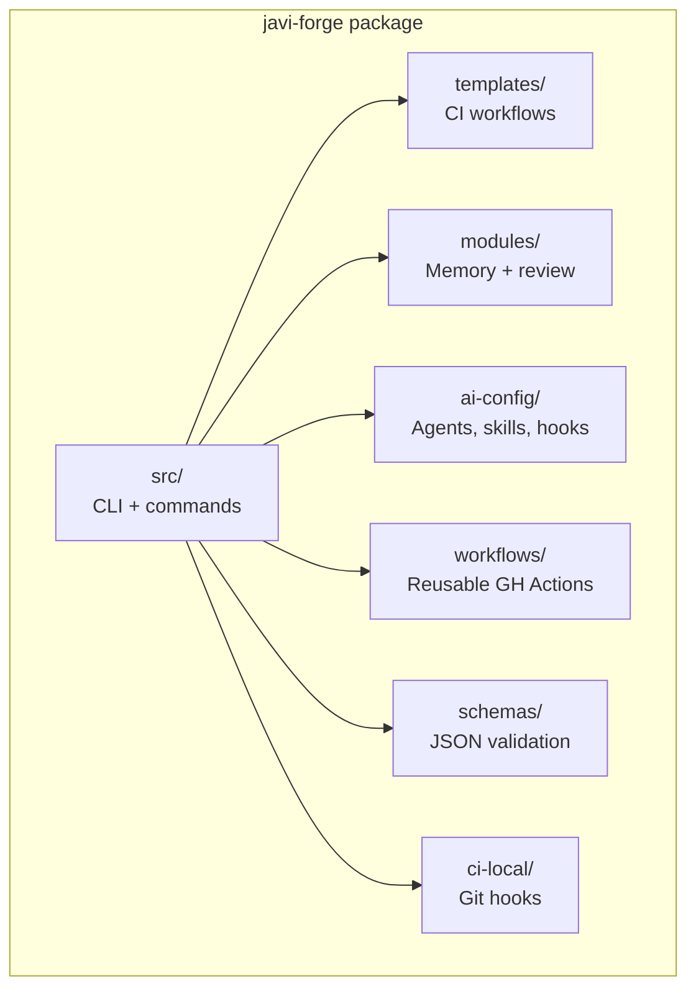
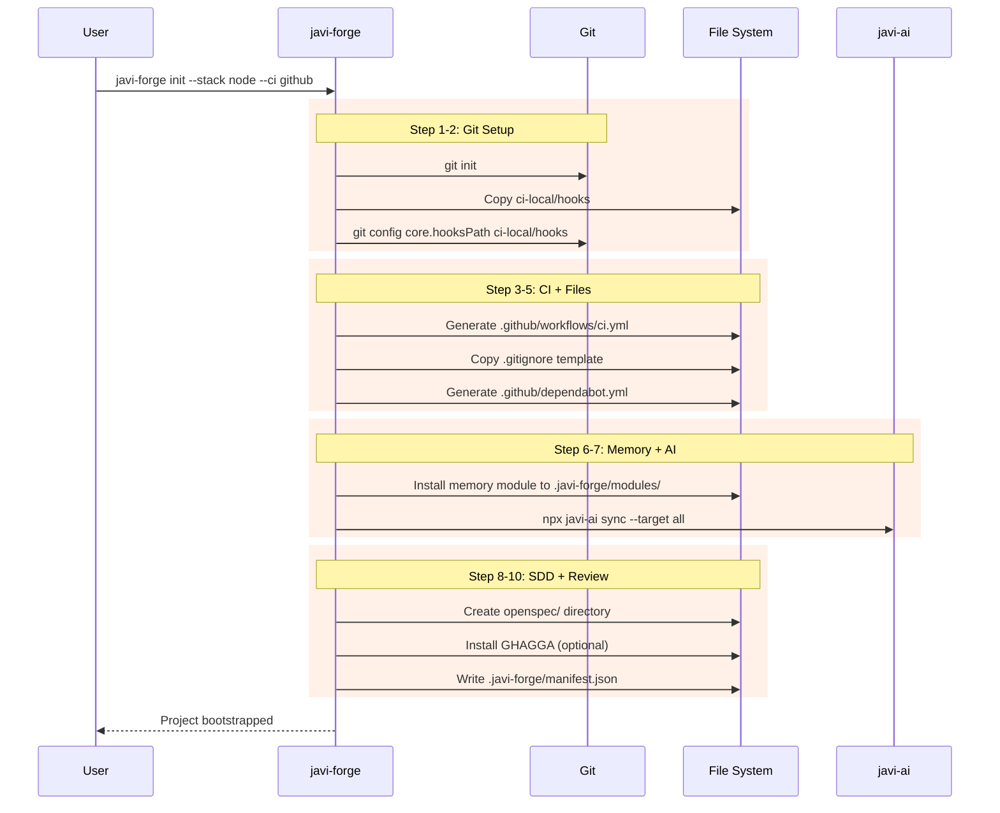
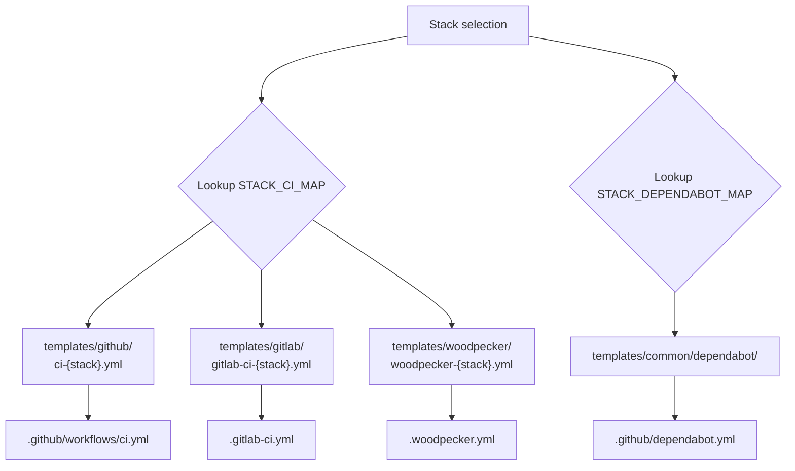
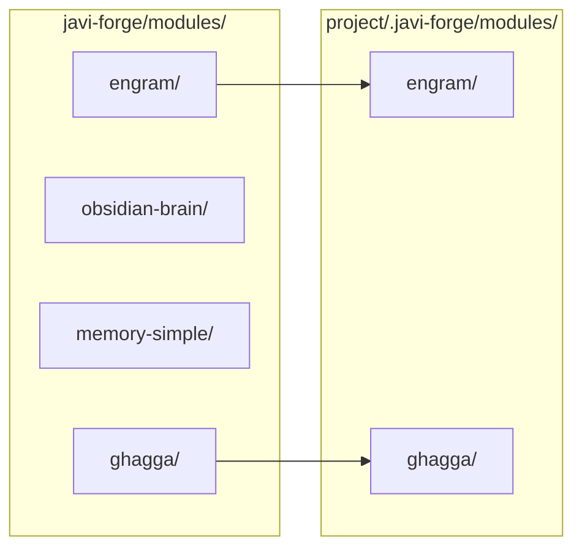
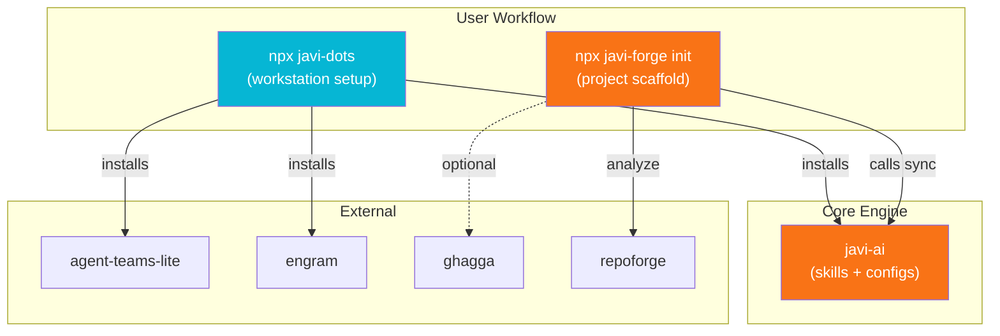

# Architecture

## Project Structure



## Init Flow

The `init` command orchestrates 10 sequential steps:



## Template Selection

Templates are selected based on stack + CI provider combination:



## Module Installation

Memory modules are copied from `modules/` to the project's `.javi-forge/modules/`:



## Manifest

The forge manifest at `.javi-forge/manifest.json` tracks project configuration:

```json
{
  "version": "0.1.0",
  "projectName": "my-app",
  "stack": "node",
  "ciProvider": "github",
  "memory": "engram",
  "createdAt": "2025-01-15T10:30:00.000Z",
  "updatedAt": "2025-01-15T10:30:00.000Z",
  "modules": ["engram", "ghagga", "sdd", "ai-config"]
}
```

## Ecosystem Integration



## Tech Stack

| Component | Technology |
|-----------|------------|
| CLI framework | [meow](https://github.com/sindresorhus/meow) |
| TUI rendering | [Ink](https://github.com/vadimdemedes/ink) (React for CLI) |
| File operations | [fs-extra](https://github.com/jprichardson/node-fs-extra) |
| YAML parsing | [yaml](https://github.com/eemeli/yaml) |
| Language | TypeScript (strict) |
| Runtime | Node.js 18+ |
| Testing | Vitest + Stryker mutation testing |
