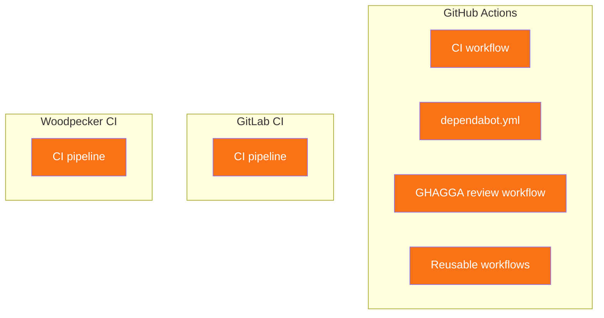

# CI Providers

`javi-forge` supports three CI/CD providers. Each gets a stack-specific workflow template plus provider-specific extras.

## GitHub Actions

The most complete integration.

| Feature | Details |
|---------|---------|
| Workflow location | `.github/workflows/ci.yml` |
| Dependabot | `.github/dependabot.yml` (auto-generated) |
| GHAGGA review | `.github/workflows/ghagga-review.yml` (if enabled) |
| Reusable workflows | Stored in `workflows/` directory |

### What gets created

```
.github/
├── workflows/
│   ├── ci.yml                # Stack-specific CI pipeline
│   └── ghagga-review.yml     # Code review (optional)
└── dependabot.yml            # Dependency updates
```

## GitLab CI

| Feature | Details |
|---------|---------|
| Workflow location | `.gitlab-ci.yml` |
| Dependabot | Not supported (use Renovate) |
| GHAGGA review | Not auto-configured |

### What gets created

```
.gitlab-ci.yml    # Stack-specific CI pipeline
```

## Woodpecker CI

For self-hosted CI with [Gitea](https://gitea.io) or [Forgejo](https://forgejo.org).

| Feature | Details |
|---------|---------|
| Workflow location | `.woodpecker.yml` |
| Dependabot | Not supported |
| GHAGGA review | Not auto-configured |

### What gets created

```
.woodpecker.yml    # Stack-specific CI pipeline
```

## Comparison



GitHub Actions provides the most comprehensive setup. GitLab and Woodpecker provide CI workflows only.
