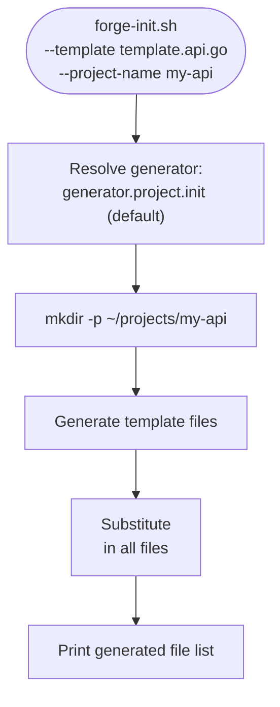
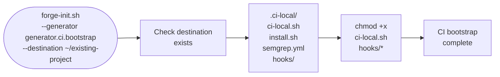
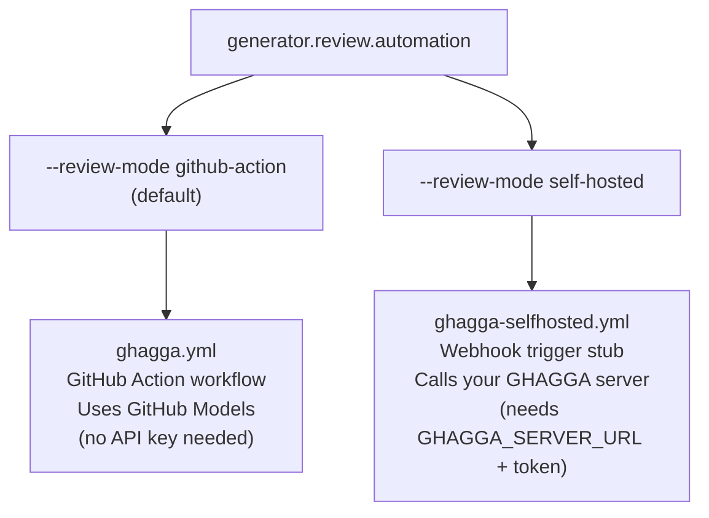
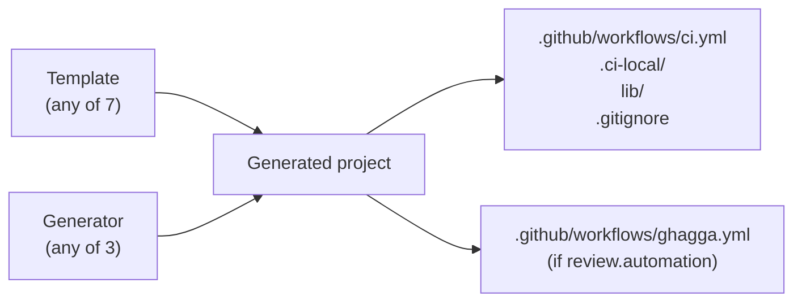

# Generators

Generators are **composable scaffolding units** that can run standalone or alongside any template. Unlike templates (which define the stack CI baseline), generators add specific capabilities to a project — AI review automation, CI family bootstrap, or the default project initialization wrapper.

---

## Generator catalog

| Generator ID | Default mode | Output | Composable with |
|-------------|-------------|--------|----------------|
| `generator.project.init` | default | Full project scaffold (wraps template) | any template |
| `generator.ci.bootstrap` | standalone | `.ci-local/` CI family only | yes, or standalone |
| `generator.review.automation` | `github-action` | `ghagga.yml` GitHub Action | yes, or standalone |
| `generator.review.automation` | `self-hosted` | Webhook-trigger stub | yes, or standalone |

---

## generator.project.init

**ID:** `generator.project.init` · **Default generator**

The default template scaffold generator. When `--template` is passed without an explicit `--generator`, `generator.project.init` is used automatically. It handles:

- Project directory creation
- File generation from the selected template
- Naming substitution (`<project-name>` replaced everywhere)
- Summary output of generated files

### Flow



### Usage

```bash
# Implicitly uses generator.project.init
scripts/forge-init.sh \
  --template template.api.go \
  --project-name my-api \
  --destination ~/projects

# Explicitly specified
scripts/forge-init.sh \
  --template template.api.go \
  --generator generator.project.init \
  --project-name my-api \
  --destination ~/projects
```

---

## generator.ci.bootstrap

**ID:** `generator.ci.bootstrap`

Adds the local CI simulation family (`.ci-local/`) to any project — standalone, without generating a full template. Use this to retrofit CI infrastructure onto an existing project.

### Generated output

```
<destination>/
└── .ci-local/
    ├── ci-local.sh          # Main local CI runner
    ├── install.sh           # Dependency installer for local CI
    ├── semgrep.yml          # Semgrep static analysis config
    └── hooks/
        ├── pre-commit       # Runs checks before commit
        ├── commit-msg       # Validates commit message format
        └── pre-push         # Runs full CI suite before push
```

### Flow



### Usage

```bash
# Standalone: add CI bootstrap to an existing project
scripts/forge-init.sh \
  --generator generator.ci.bootstrap \
  --project-name existing-project \
  --destination ~/existing-project

# Composable: template + CI bootstrap (CI bootstrap is included by default in most templates)
scripts/forge-init.sh \
  --template template.web.base \
  --generator generator.ci.bootstrap \
  --project-name my-app \
  --destination ~/projects
```

### Installing hooks after generation

```bash
cd ~/existing-project
.ci-local/install.sh
# Hooks are now active in .git/hooks/
```

---

## generator.review.automation

**ID:** `generator.review.automation` · **Modes:** `github-action` (default) | `self-hosted`

Generates an AI-powered code review workflow using the GHAGGA (GitHub Actions + AI) system. Two modes are available:



---

### Mode: github-action (default)

Uses **GitHub Models** (free tier, no external API key) to power AI code review directly within GitHub Actions. The review runs on `pull_request` events and posts a summary comment.

#### Generated output

```
.github/
└── workflows/
    └── ghagga.yml
```

#### Generated workflow (excerpt)

```yaml
# .github/workflows/ghagga.yml
name: AI Code Review (GHAGGA)
on:
  pull_request:
    types: [opened, synchronize]

permissions:
  contents: read
  pull-requests: write

jobs:
  review:
    runs-on: ubuntu-latest
    steps:
      - uses: actions/checkout@v4
        with:
          fetch-depth: 0
      - name: Run GHAGGA review
        uses: JNZader/ghagga-action@v1
        with:
          model: gpt-4o-mini        # GitHub Models free tier
          github-token: ${{ secrets.GITHUB_TOKEN }}
```

#### Usage

```bash
# Default mode (github-action)
scripts/forge-init.sh \
  --generator generator.review.automation \
  --project-name my-project \
  --destination ~/projects

# Combine with template
scripts/forge-init.sh \
  --template template.api.go \
  --generator generator.review.automation \
  --project-name my-go-api \
  --destination ~/projects
```

---

### Mode: self-hosted

Generates a webhook-trigger stub for teams running their own GHAGGA review server. Requires `GHAGGA_SERVER_URL` and `GHAGGA_API_TOKEN` set as repository secrets.

#### Generated output

```
.github/
└── workflows/
    └── ghagga-selfhosted.yml
```

#### Generated workflow (excerpt)

```yaml
# .github/workflows/ghagga-selfhosted.yml
name: AI Code Review (GHAGGA Self-Hosted)
on:
  workflow_dispatch:
    inputs:
      pr_number:
        description: 'PR number to review'
        required: true

jobs:
  review:
    runs-on: ubuntu-latest
    steps:
      - name: Trigger GHAGGA review
        run: |
          curl -X POST "${{ secrets.GHAGGA_SERVER_URL }}/review" \
            -H "Authorization: Bearer ${{ secrets.GHAGGA_API_TOKEN }}" \
            -d '{"pr": "${{ inputs.pr_number }}", "repo": "${{ github.repository }}"}'
```

#### Usage

```bash
scripts/forge-init.sh \
  --generator generator.review.automation \
  --review-mode self-hosted \
  --project-name my-project \
  --destination ~/projects
```

#### Required secrets

| Secret | Description |
|--------|-------------|
| `GHAGGA_SERVER_URL` | URL of your self-hosted GHAGGA server |
| `GHAGGA_API_TOKEN` | API token for authentication |

---

## Combining generators with templates

Generators are fully composable with any template:



```bash
# Python API + review automation + dry-run
scripts/forge-init.sh \
  --template template.api.python \
  --generator generator.review.automation \
  --project-name my-service \
  --destination ~/projects \
  --dry-run
```

---

## List all contracts

```bash
scripts/forge-init.sh --list-contracts
```

Output includes all generator IDs, template IDs, stack IDs, and review modes.
