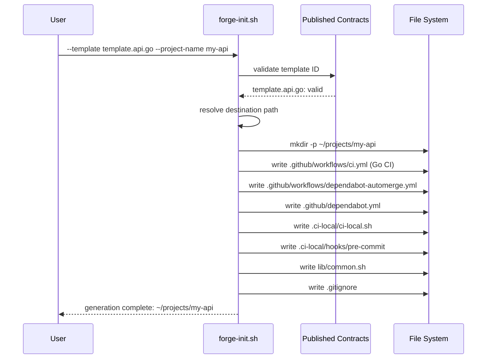

# Getting Started

## Prerequisites

- A POSIX-compatible shell (bash, zsh)
- `git`
- For javi-dots integration: sibling repos cloned

```
platform/
├── javi-dots/       ← orchestrator (recommended)
├── javi-ai/         ← required for AI package requests
└── javi-forge/      ← this repo
```

---

## Use via javi-dots (recommended)

`javi-dots` is the standard way to invoke `javi-forge`. It calls `forge-init.sh` via contract IDs, so you get full orchestration including AI package injection.

<!-- tabs:start -->

#### **Web project**

```bash
cd javi-dots
scripts/javi.sh --preset forge \
  --template-choice forge.template.web.base \
  --project-name my-app \
  --home "$HOME"
```

#### **Go API + review automation**

```bash
cd javi-dots
scripts/javi.sh --preset forge \
  --template-choice forge.template.api.go \
  --generator-choice forge.generator.review.automation \
  --project-name my-api \
  --home "$HOME"
```

#### **Python API + AI packages**

```bash
cd javi-dots
scripts/javi.sh --preset forge \
  --template-choice forge.template.api.python \
  --ai-package project.ai.instructions \
  --project-name my-service \
  --home "$HOME"
```

<!-- tabs:end -->

---

## Use forge-init.sh standalone

For direct use without `javi-dots`:

### Step 1 — Clone javi-forge

```bash
git clone https://github.com/JNZader/javi-forge.git
cd javi-forge
```

### Step 2 — Discover available contracts

```bash
scripts/forge-init.sh --list-contracts
```

### Step 3 — Dry-run first

```bash
scripts/forge-init.sh \
  --template template.api.go \
  --project-name my-api \
  --destination ~/projects \
  --dry-run
```

### Step 4 — Generate the project

```bash
scripts/forge-init.sh \
  --template template.api.go \
  --project-name my-api \
  --destination ~/projects
```

---

## Common patterns

### Template only

```bash
# Node.js web project
scripts/forge-init.sh \
  --template template.web.base \
  --project-name my-app \
  --destination ~/projects

# Java / Spring Boot API
scripts/forge-init.sh \
  --template template.api.java \
  --project-name my-service \
  --destination ~/projects

# Documentation site (MkDocs)
scripts/forge-init.sh \
  --template template.docs.base \
  --project-name my-docs \
  --destination ~/projects
```

### Template + review automation

```bash
# Python API with AI review (GitHub Action mode)
scripts/forge-init.sh \
  --template template.api.python \
  --generator generator.review.automation \
  --project-name my-api \
  --destination ~/projects

# Same but self-hosted review server
scripts/forge-init.sh \
  --template template.api.python \
  --generator generator.review.automation \
  --review-mode self-hosted \
  --project-name my-api \
  --destination ~/projects
```

### Generator standalone

```bash
# Add CI bootstrap to an existing project
scripts/forge-init.sh \
  --generator generator.ci.bootstrap \
  --project-name existing-project \
  --destination ~/existing-project

# Add review automation to an existing project
scripts/forge-init.sh \
  --generator generator.review.automation \
  --project-name existing-project \
  --destination ~/existing-project
```

---

## Generation flow



---

## What gets generated

All templates generate a common baseline structure:

```
<project-name>/
├── .github/
│   ├── workflows/
│   │   ├── ci.yml                     # Stack-specific CI workflow
│   │   └── dependabot-automerge.yml
│   └── dependabot.yml
├── .ci-local/                          # Local CI simulation
│   ├── ci-local.sh
│   ├── install.sh
│   ├── semgrep.yml
│   └── hooks/
│       ├── pre-commit
│       ├── commit-msg
│       └── pre-push
├── lib/
│   └── common.sh
└── .gitignore
```

The `docs.base` template additionally generates:

```
├── docs/
│   └── index.md
└── mkdocs.yml.example
```

---

## Next steps

- [Templates](/templates) — explore all 7 templates and their generated CI workflows
- [Generators](/generators) — understand generator modes and composition
- [AI Integration](/ai-integration) — add AI packages to generated projects
