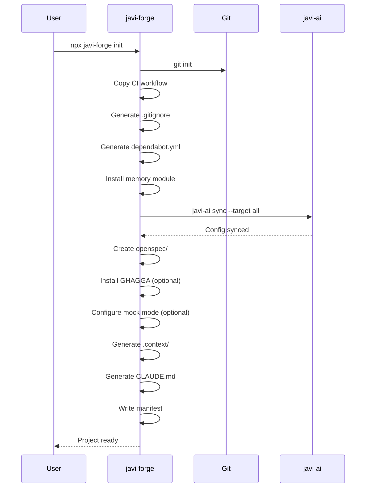

# Getting Started

## Prerequisites

- **Node.js 18+** — [nodejs.org](https://nodejs.org)

Optional (for full functionality):
- **javi-ai** — for AI config sync (`npm install -g javi-ai`)
- **repoforge** — for `analyze` command (`pip install repoforge`)

## Step 1: Initialize a Project

```bash
npx javi-forge init
```

The TUI walks you through:

1. **Project name** — name for your project
2. **Stack** — node, python, go, java-gradle, java-maven, rust, or elixir
3. **CI provider** — GitHub Actions, GitLab CI, or Woodpecker
4. **Memory module** — engram, obsidian-brain, memory-simple, or none
5. **SDD** — enable Spec-Driven Development
6. **GHAGGA** — enable AI code review
7. **.context/** — generate project context directory for AI tools
8. **CLAUDE.md** — generate project-aware Claude configuration

## Step 2: Non-Interactive Mode

For automation or CI, pass all options via flags:

```bash
npx javi-forge init \
  --project-name my-app \
  --stack node \
  --ci github \
  --memory engram \
  --ghagga \
  --batch
```

### Dry Run

Preview what would be created without writing files:

```bash
npx javi-forge init --dry-run --stack node --ci github --batch
```

## Step 3: Verify

Run the doctor command:

```bash
npx javi-forge doctor
```

This checks system tools, framework structure, stack detection, and installed modules.

## What Gets Created



## Next Steps

- Start coding with AI assistance — your CLAUDE.md, AGENTS.md, etc. are already configured
- Use `/sdd:new <name>` to start a new feature with Spec-Driven Development
- Run `npx javi-forge analyze` to get skill recommendations for your codebase
