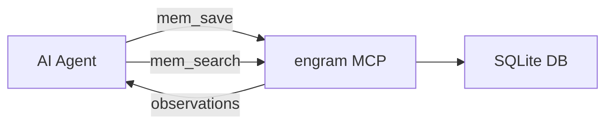

# Memory Modules

Memory modules give AI coding assistants persistent context across sessions. `javi-forge` supports three options.

## engram

The recommended option. Provides persistent AI memory via an MCP (Model Context Protocol) server.

| Feature | Details |
|---------|---------|
| Type | MCP server (SQLite-backed) |
| Sessions | Cross-session memory with timeline |
| Search | Full-text search across observations |
| Integration | Claude Code, OpenCode, and other MCP-compatible CLIs |
| Install | `brew install gentleman-programming/tap/engram` |

### What gets installed

- Module files copied to `.javi-forge/modules/engram/`
- MCP config snippet at `.mcp-config-snippet.json`
- Memory protocol instructions for AI agents

### How it works

## obsidian-brain

For teams using [Obsidian](https://obsidian.md) as a knowledge base.

| Feature | Details |
|---------|---------|
| Type | File-based (Markdown) |
| Sessions | Kanban board tracking |
| Search | Dataview queries |
| Integration | Obsidian app + AI agents |

### What it provides

- Kanban board templates for task tracking
- Dataview inline fields for metadata
- Session tracking templates
- Wave execution integration

## memory-simple

Minimal file-based project memory for lightweight setups.

| Feature | Details |
|---------|---------|
| Type | File-based (Markdown) |
| Sessions | Single-file memory |
| Search | Manual / grep |
| Integration | Any AI CLI |

Good for small projects or when you don't want external dependencies.

## none

Skip memory module installation entirely. You can always add one later by running `javi-forge init` again.

## Comparison

| Feature | engram | obsidian-brain | memory-simple |
|---------|--------|----------------|---------------|
| Persistence | SQLite | Markdown files | Markdown file |
| Search | FTS5 full-text | Dataview queries | Manual |
| Cross-session | Yes | Yes | Limited |
| External deps | Homebrew | Obsidian | None |
| Best for | Full AI workflow | Knowledge workers | Minimal setup |
