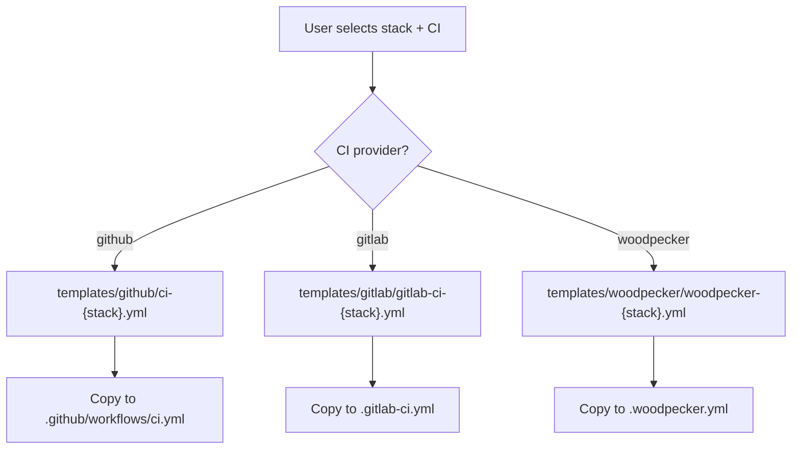

# Templates

`javi-forge` ships CI/CD workflow templates for 7 stacks across 3 CI providers. Templates are stored in `templates/` and selected during `init`.

## Stack Templates

### Node.js

| Provider | Template | File |
|----------|----------|------|
| GitHub | `ci-node.yml` | `.github/workflows/ci.yml` |
| GitLab | `gitlab-ci-node.yml` | `.gitlab-ci.yml` |
| Woodpecker | `woodpecker-node.yml` | `.woodpecker.yml` |

Dependabot: npm ecosystem

### Python

| Provider | Template | File |
|----------|----------|------|
| GitHub | `ci-python.yml` | `.github/workflows/ci.yml` |
| GitLab | `gitlab-ci-python.yml` | `.gitlab-ci.yml` |
| Woodpecker | `woodpecker-python.yml` | `.woodpecker.yml` |

Dependabot: pip ecosystem

### Go

| Provider | Template | File |
|----------|----------|------|
| GitHub | `ci-go.yml` | `.github/workflows/ci.yml` |
| GitLab | `gitlab-ci-go.yml` | `.gitlab-ci.yml` |
| Woodpecker | `woodpecker-go.yml` | `.woodpecker.yml` |

Dependabot: gomod ecosystem

### Java (Gradle)

| Provider | Template | File |
|----------|----------|------|
| GitHub | `ci-java.yml` | `.github/workflows/ci.yml` |
| GitLab | `gitlab-ci-java.yml` | `.gitlab-ci.yml` |
| Woodpecker | `woodpecker-java.yml` | `.woodpecker.yml` |

Dependabot: gradle ecosystem

### Java (Maven)

| Provider | Template | File |
|----------|----------|------|
| GitHub | `ci-java.yml` | `.github/workflows/ci.yml` |
| GitLab | `gitlab-ci-java.yml` | `.gitlab-ci.yml` |
| Woodpecker | `woodpecker-java.yml` | `.woodpecker.yml` |

Dependabot: maven ecosystem

### Rust

| Provider | Template | File |
|----------|----------|------|
| GitHub | `ci-rust.yml` | `.github/workflows/ci.yml` |
| GitLab | `gitlab-ci-rust.yml` | `.gitlab-ci.yml` |
| Woodpecker | `woodpecker-rust.yml` | `.woodpecker.yml` |

Dependabot: cargo ecosystem

### Elixir

| Provider | Template | File |
|----------|----------|------|
| GitHub | — | — |
| GitLab | — | — |
| Woodpecker | — | — |

> Elixir templates are planned. No dependabot ecosystem mapping is configured.

## Common Templates

In addition to stack-specific CI, `javi-forge` includes:

- **dependabot.yml** — Generated from fragments in `templates/common/dependabot/`
- **renovate.json** — Renovate Bot configuration
- **.gitignore** — Universal gitignore template
- **Global AI configs** — CLI-specific config templates in `templates/global/`

## Template Selection

