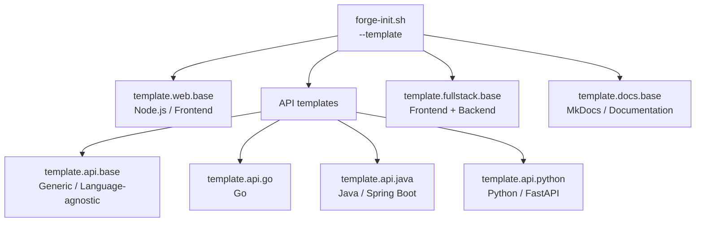
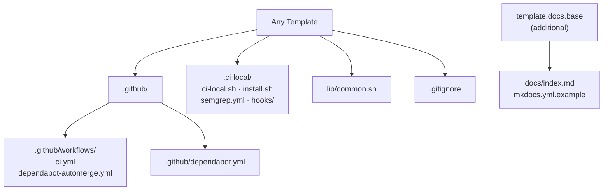

# Templates

javi-forge provides 7 production-ready project templates spanning the most common stacks. Every template generates a complete CI/CD baseline including GitHub Actions workflows, local CI simulation, and dependency management.

---

## Template taxonomy



---

## Summary table

| Template ID | Stack | CI Actions | Local CI | Extras |
|-------------|-------|-----------|----------|--------|
| `template.web.base` | Node.js | Node CI (test + build) | yes | dependabot |
| `template.api.base` | Any (generic) | Language-agnostic CI | yes | dependabot |
| `template.api.go` | Go | golangci-lint + go test | yes | dependabot |
| `template.api.java` | Java / Spring Boot | Spotless + Gradle test | yes | dependabot |
| `template.api.python` | Python / FastAPI | ruff + pytest | yes | dependabot |
| `template.fullstack.base` | Any frontend + backend | Parallel jobs | yes | dependabot |
| `template.docs.base` | MkDocs | Build strict + gh-deploy | no | mkdocs.yml.example |

---

## template.web.base

**Stack:** Node.js / Frontend · **ID:** `template.web.base`

The standard web project template. Generates a Node.js CI workflow covering lint, test, and build steps.

### Generated CI workflow (excerpt)

```yaml
# .github/workflows/ci.yml
name: CI
on: [push, pull_request]
jobs:
  test:
    runs-on: ubuntu-latest
    steps:
      - uses: actions/checkout@v4
      - uses: actions/setup-node@v4
        with:
          node-version: '20'
          cache: 'npm'
      - run: npm ci
      - run: npm test
      - run: npm run build
```

### Usage

```bash
scripts/forge-init.sh \
  --template template.web.base \
  --project-name my-app \
  --destination ~/projects
```

---

## template.api.base

**Stack:** Language-agnostic · **ID:** `template.api.base`

A generic API baseline for teams that want CI infrastructure without stack-specific tooling. The CI workflow provides a minimal shell-scriptable entry point.

### Generated CI workflow (excerpt)

```yaml
# .github/workflows/ci.yml
name: CI
on: [push, pull_request]
jobs:
  build:
    runs-on: ubuntu-latest
    steps:
      - uses: actions/checkout@v4
      - name: Build
        run: echo "Add your build step here"
      - name: Test
        run: echo "Add your test step here"
```

### Usage

```bash
scripts/forge-init.sh \
  --template template.api.base \
  --project-name my-service \
  --destination ~/projects
```

---

## template.api.go

**Stack:** Go · **ID:** `template.api.go`

Go API template with `golangci-lint` for static analysis and `go test ./...` for full test coverage.

### Generated CI workflow (excerpt)

```yaml
# .github/workflows/ci.yml
name: CI
on: [push, pull_request]
jobs:
  test:
    runs-on: ubuntu-latest
    steps:
      - uses: actions/checkout@v4
      - uses: actions/setup-go@v5
        with:
          go-version: '1.22'
      - name: Lint
        uses: golangci/golangci-lint-action@v6
      - name: Test
        run: go test ./...
```

### Usage

```bash
scripts/forge-init.sh \
  --template template.api.go \
  --project-name my-api \
  --destination ~/projects
```

---

## template.api.java

**Stack:** Java / Spring Boot · **ID:** `template.api.java`

Java / Spring Boot template using Gradle for builds, Spotless for code formatting enforcement, and Gradle test for the test suite.

### Generated CI workflow (excerpt)

```yaml
# .github/workflows/ci.yml
name: CI
on: [push, pull_request]
jobs:
  test:
    runs-on: ubuntu-latest
    steps:
      - uses: actions/checkout@v4
      - uses: actions/setup-java@v4
        with:
          java-version: '21'
          distribution: 'temurin'
      - name: Format check
        run: ./gradlew spotlessCheck
      - name: Test
        run: ./gradlew test
```

### Usage

```bash
scripts/forge-init.sh \
  --template template.api.java \
  --project-name my-service \
  --destination ~/projects
```

---

## template.api.python

**Stack:** Python / FastAPI · **ID:** `template.api.python`

Python template with `ruff` for linting and formatting, and `pytest` for test execution.

### Generated CI workflow (excerpt)

```yaml
# .github/workflows/ci.yml
name: CI
on: [push, pull_request]
jobs:
  test:
    runs-on: ubuntu-latest
    steps:
      - uses: actions/checkout@v4
      - uses: actions/setup-python@v5
        with:
          python-version: '3.12'
      - run: pip install -r requirements.txt
      - name: Lint
        run: ruff check .
      - name: Test
        run: pytest
```

### Usage

```bash
scripts/forge-init.sh \
  --template template.api.python \
  --project-name my-api \
  --destination ~/projects
```

---

## template.fullstack.base

**Stack:** Any frontend + backend · **ID:** `template.fullstack.base`

Fullstack template with parallel CI jobs — frontend (Node.js) and backend (generic) run in parallel to minimize pipeline time.

### Generated CI workflow (excerpt)

```yaml
# .github/workflows/ci.yml
name: CI
on: [push, pull_request]
jobs:
  frontend:
    runs-on: ubuntu-latest
    steps:
      - uses: actions/checkout@v4
      - uses: actions/setup-node@v4
      - run: npm ci && npm test && npm run build

  backend:
    runs-on: ubuntu-latest
    steps:
      - uses: actions/checkout@v4
      - name: Build backend
        run: echo "Add your backend build/test here"
```

### Usage

```bash
scripts/forge-init.sh \
  --template template.fullstack.base \
  --project-name my-app \
  --destination ~/projects
```

---

## template.docs.base

**Stack:** MkDocs · **ID:** `template.docs.base`

Documentation site template. Generates a MkDocs build + GitHub Pages deploy workflow, a starter `docs/index.md`, and a `mkdocs.yml.example` config to customize.

### Generated output (unique to this template)

```
<project-name>/
├── .github/
│   └── workflows/
│       └── ci.yml        # MkDocs build strict + gh-deploy
├── docs/
│   └── index.md          # Starter page
└── mkdocs.yml.example    # Rename to mkdocs.yml
```

### Generated CI workflow (excerpt)

```yaml
# .github/workflows/ci.yml
name: CI
on:
  push:
    branches: [main]
  pull_request:

jobs:
  build:
    runs-on: ubuntu-latest
    steps:
      - uses: actions/checkout@v4
      - uses: actions/setup-python@v5
        with:
          python-version: '3.12'
      - run: pip install mkdocs-material
      - run: mkdocs build --strict
  deploy:
    needs: build
    if: github.ref == 'refs/heads/main'
    runs-on: ubuntu-latest
    steps:
      - uses: actions/checkout@v4
      - run: pip install mkdocs-material && mkdocs gh-deploy --force
```

### After generating

```bash
# 1. Rename the example config
mv mkdocs.yml.example mkdocs.yml

# 2. Update site_name in mkdocs.yml
# 3. Serve locally
pip install mkdocs-material
mkdocs serve
```

### Usage

```bash
scripts/forge-init.sh \
  --template template.docs.base \
  --project-name my-docs \
  --destination ~/projects
```

---

## Common generated files (all templates)


